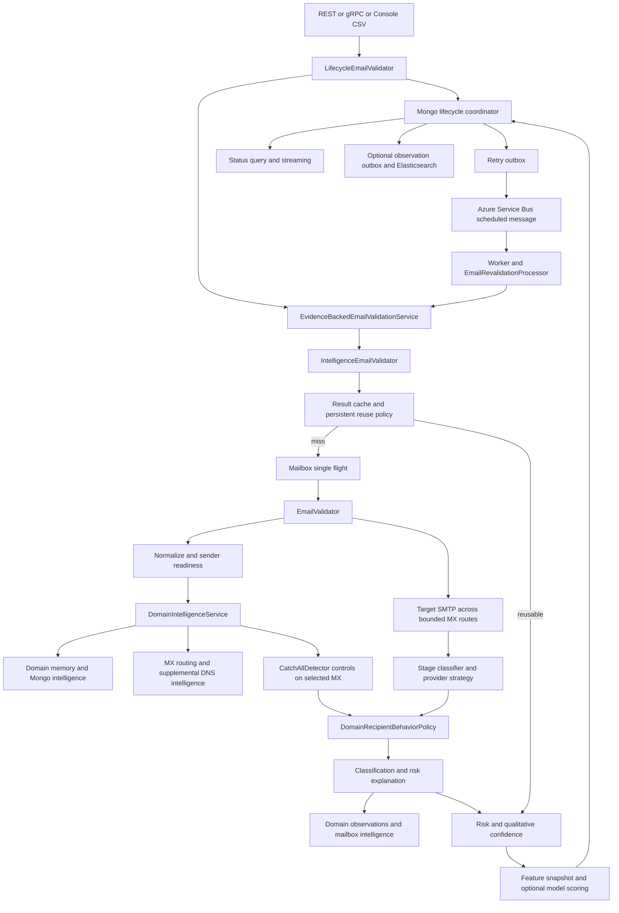

# Current validation architecture

The repository uses .NET 10 with eight source projects. Domain holds semantic records; Core retains orchestration, ports and compatibility types; Application holds intelligence, job and model policies; Infrastructure implements DNS, SMTP, stores and queues. API, Console, Worker and gRPC are adapters. The existing interfaces support incremental changes, although evidence and policy ownership span Core and Application.

## Active flow

The retry worker calls `IEmailValidationService`, not the outer initial-lifecycle wrapper. Bulk jobs call the shared validator through `DomainValidationScheduler`. Requests can disable SMTP; syntax and domain intelligence still operate. Model execution depends on rollout configuration and availability of a correlated snapshot. The diagram shows connected capabilities, not proof they are enabled in production.

## Entry points and dependencies

| Surface | Actual implementation |
| --- | --- |
| REST under `/v1` | [ApiEndpoints.cs · group.MapPost("/email-validations"](/Users/wpearson4/projects/EmailValidation/src/EmailValidation.Api/ApiEndpoints.cs:20); single validation, status GET, bulk job create/list/status/results/file, purchased-result and source-file workflows |
| REST contracts | [ApiContracts.cs · public sealed record EmailValidationV1Response](/Users/wpearson4/projects/EmailValidation/src/EmailValidation.Api/ApiContracts.cs:71); status, confidence, confidence level, reasons/context, recipient behavior and provenance summary |
| API host | [Program.cs · var builder = WebApplication.CreateBuilder](/Users/wpearson4/projects/EmailValidation/src/EmailValidation.Api/Program.cs:16); configuration, authentication, ownership policy, API platform controls, gRPC |
| gRPC | [EmailValidationGrpcService.cs · class EmailValidationGrpcService](/Users/wpearson4/projects/EmailValidation/src/EmailValidation.Grpc/EmailValidationGrpcService.cs:11) and [EmailValidationStatusGrpcService.cs · class EmailValidationStatusGrpcService](/Users/wpearson4/projects/EmailValidation/src/EmailValidation.Grpc/EmailValidationStatusGrpcService.cs:12); validation and lifecycle query/stream |
| Console and CSV | [ConsoleApplication.cs · class ConsoleApplication](/Users/wpearson4/projects/EmailValidation/src/EmailValidation.Console/ConsoleApplication.cs:9); [CsvFileProcessor.cs · class CsvFileProcessor](/Users/wpearson4/projects/EmailValidation/src/EmailValidation.Console/CsvFileProcessor.cs:21); application scheduler |
| Bulk use case | [ValidationJobs.cs · class ValidationJobProcessor](/Users/wpearson4/projects/EmailValidation/src/EmailValidation.Application/ValidationJobs.cs:531); claimed chunks, lease renewal, per-item completion and projection |
| Background hosts | [Program.cs · AddHostedService<ServiceBusRevalidationWorker>](/Users/wpearson4/projects/EmailValidation/src/EmailValidation.Worker/Program.cs:25); retry/job receivers, outbox dispatchers, optional projection/reconciliation |
| Dependency injection | [ServiceCollectionExtensions.cs · AddSingleton<IEmailValidator, LifecycleEmailValidator>](/Users/wpearson4/projects/EmailValidation/src/EmailValidation.Infrastructure/ServiceCollectionExtensions.cs:252); all hosts use common registrations |

## Validation and intelligence components

| Responsibility | Class and method | Dependencies and behavior |
| --- | --- | --- |
| Initial lifecycle | [RevalidationServices.cs · public sealed class LifecycleEmailValidator](/Users/wpearson4/projects/EmailValidation/src/EmailValidation.Core/RevalidationServices.cs:734) | Coordinator Begin, shared service, ProcessInitialResult; failure finalization |
| Reuse and coalescing | [ValidationIntelligenceServices.cs · public sealed class IntelligenceEmailValidator](/Users/wpearson4/projects/EmailValidation/src/EmailValidation.Core/ValidationIntelligenceServices.cs:834) | Normalizer, result cache, intelligence store, reuse policy, process-local single flight, risk evaluator |
| Mailbox execution | [EmailValidator.cs · public sealed class EmailValidator](/Users/wpearson4/projects/EmailValidation/src/EmailValidation.Core/EmailValidator.cs:7) | Domain acquisition, sender health, MX probes, provider reconciliation, history, classifier, observation persistence |
| Domain acquisition | [DomainIntelligenceServices.cs · public async Task<DomainIntelligenceAcquisition> AcquireAsync](/Users/wpearson4/projects/EmailValidation/src/EmailValidation.Application/DomainIntelligenceServices.cs:150) | Separate domain/catch-all flights, bounded analysis semaphore, freshness policy, domain cache |
| DNS routing | [MxDnsResolver.cs · public async Task<DnsLookupResult> ResolveAsync](/Users/wpearson4/projects/EmailValidation/src/EmailValidation.Infrastructure/MxDnsResolver.cs:17) | Custom UDP wire MX lookup, truncated-response TCP fallback, retries, OS A/AAAA fallback |
| DNS enrichment | [DnsIntelligenceAnalyzers.cs · internal sealed class EmailAuthenticationAnalyzer](/Users/wpearson4/projects/EmailValidation/src/EmailValidation.Infrastructure/DnsIntelligenceAnalyzers.cs:95) | TXT SPF/DMARC parsing, DKIM NotEvaluated; separate DNSSEC resolver evidence |
| Infrastructure availability | [IntelligenceProviders.cs · public sealed class MailInfrastructureInspector](/Users/wpearson4/projects/EmailValidation/src/EmailValidation.Infrastructure/IntelligenceProviders.cs:169) | Resolve MX hosts; known no-address versus transient failure distinction |
| Provider identity | [DomainIntelligence.cs · public sealed class MailProviderDetector](/Users/wpearson4/projects/EmailValidation/src/EmailValidation.Infrastructure/DomainIntelligence.cs:109) | Owned-domain table, lowest-preference MX suffixes, topology fingerprint; SMTP banner detector adds observed identity |
| SMTP session | [SmtpMailboxProbe.cs · private async Task<SmtpProbeResult> ProbeOnceAsync](/Users/wpearson4/projects/EmailValidation/src/EmailValidation.Infrastructure/SmtpMailboxProbe.cs:161) | Selected bound identity, throttle, reputation budgets, per-address session budget, stage timings and sanitized responses |
| Reply interpretation | [SmtpResponseIntelligencePolicy.cs · public sealed class SmtpResponseClassificationOrchestrator](/Users/wpearson4/projects/EmailValidation/src/EmailValidation.Application/SmtpResponseIntelligencePolicy.cs:118) | Canonical legacy classifier plus candidate rules in Disabled/Shadow/Enforced modes |
| Provider interpretation | [ProviderStrategies.cs · public sealed class MailProviderStrategyResolver](/Users/wpearson4/projects/EmailValidation/src/EmailValidation.Core/ProviderStrategies.cs:3) | Microsoft, Google, Proofpoint, Mimecast, generic strategies; provider limits separately configurable |
| Recipient behavior | [CatchAllDetector.cs · public async Task<CatchAllDetectionResult> DetectAsync](/Users/wpearson4/projects/EmailValidation/src/EmailValidation.Infrastructure/CatchAllDetector.cs:14) and [DomainRecipientBehaviorPolicy.cs · public static CatchAllDetectionResult Evaluate](/Users/wpearson4/projects/EmailValidation/src/EmailValidation.Core/DomainRecipientBehaviorPolicy.cs:95) | Adaptive controls, correlated target evidence, independent observations, contradiction handling |
| Final deterministic classification | [ClassificationEngine.cs · public ClassificationResult Classify(EmailClassificationEvidence evidence)](/Users/wpearson4/projects/EmailValidation/src/EmailValidation.Core/ClassificationEngine.cs:14) | Syntax/routing precedence, provider evidence, recipient behavior and heuristic confidence |
| Public explanation and risk | [ResultEvaluator.cs · public ResultEvaluation Evaluate](/Users/wpearson4/projects/EmailValidation/src/EmailValidation.Core/ResultEvaluator.cs:5); [ConfidenceLevelPolicy.cs · public ConfidenceLevel Evaluate](/Users/wpearson4/projects/EmailValidation/src/EmailValidation.Core/ConfidenceLevelPolicy.cs:18) | Detailed reasons, send recommendation, separate risk; Unknown confidence level Low |
| Features and prediction | [EvidenceBackedClassification.cs · public sealed class EvidenceBackedEmailValidationService](/Users/wpearson4/projects/EmailValidation/src/EmailValidation.Application/EvidenceBackedClassification.cs:921) | Snapshot factory/store, optional scorer/calibrator, uncertainty and versioned decision policy |

## Persistence and domain profile

A Domain Intelligence Profile effectively exists already in [EvidenceModels.cs · public sealed record DomainIntelligence](/Users/wpearson4/projects/EmailValidation/src/EmailValidation.Domain/EvidenceModels.cs:278). It includes DNS/MX, provider/family/gateway, catch-all/accept-all state, confidence and observation count, timestamps, evidence expiry, authentication fingerprints, topology/provider fingerprints, change count, strategy version, supplemental risk and a behavior summary. Extend this record and its persistence mapping rather than introduce a competing source of truth.

Mongo stores domain facts plus two bounded embedded observation arrays; mailbox records hold previous classification, evidence times, provider/policy/topology and a sanitized result. Lifecycle records hold canonical current result, version, attempt history, request context and embedded pending retry. Jobs/items, ownership, outbound identity health, reputation states, model snapshots/outcomes and optional projection outbox have separate stores. Relevant methods: [MongoValidationIntelligenceStore.cs · public async Task SaveDomainAsync](/Users/wpearson4/projects/EmailValidation/src/EmailValidation.Infrastructure/MongoValidationIntelligenceStore.cs:163), [MongoValidationIntelligenceStore.cs · public async Task SaveMailboxAsync](/Users/wpearson4/projects/EmailValidation/src/EmailValidation.Infrastructure/MongoValidationIntelligenceStore.cs:235), [MongoValidationLifecycleStore.cs · public async Task<LifecycleWriteResult> TrySaveAsync](/Users/wpearson4/projects/EmailValidation/src/EmailValidation.Infrastructure/MongoValidationLifecycleStore.cs:92).

Mongo selection is conditional on persistence configuration. JSON/local alternatives remain. The legacy `IDeliveryOutcomeStore`, recorder and global suppression interfaces still resolve to JSON even when Mongo is selected; newer model outcome observations use the Mongo classification evidence store. Consolidating these paths requires explicit migration rather than assuming all history is already Mongo-backed. [ServiceCollectionExtensions.cs · AddSingleton<IDeliveryOutcomeStore>](/Users/wpearson4/projects/EmailValidation/src/EmailValidation.Infrastructure/ServiceCollectionExtensions.cs:121).

Feature/outcome records use tenant-aware correlation. Operational Mongo records still retain normalized addresses and JSON payloads; hashing the document ID does not remove those fields. No TTL/deletion policy was found for the core mailbox, lifecycle, job, snapshot or outcome collections; projection outbox retention is a separate capability.

## Retries and consistency

`RevalidationPolicy` decides eligibility and maximum attempts; `RevalidationSchedulePolicy` uses cooldown/backoff; an embedded Mongo outbox survives broker scheduling failure. `AzureServiceBusRevalidationScheduler.ScheduleAsync` uses scheduled messages with `validationId:attemptNumber` IDs. Worker uses PeekLock, explicit completion, lock renewal and infrastructure-error abandon/DLQ handling. `EmailRevalidationProcessor.ProcessAsync` rejects stale/final messages and coordinates transitions. Recovery scans overdue RetryWaiting lifecycles. This is substantial durability, but a lifecycle CAS is not an exclusive network-execution lease. See EV04 in the backlog.

## Caches and concurrency

Mailbox result cache is bounded to 10,000 entries by default. Mailbox/domain/catch-all single flight is process-local. SMTP concurrency, domain pacing and provider circuits are process-local. Reputation protection has Mongo CAS-backed scope reservations, but defaults to Observe and is distinct from distributed concurrency limits. Domain memory and the Mongo store’s mailbox dictionary have no overall size bound; the bounded result cache also retains insertion tokens independently of entry expiry.

## Configuration and diagnostics

API and Worker load Azure App Configuration/Key Vault bootstrap plus environment overrides; deployed values were not read. Defaults: response intelligence Shadow; model Disabled; reputation Observe; DNS/domain and catch-all intelligence enabled; retry disabled unless configured. Console’s checked-in settings select Mongo and live SMTP, with conservative provider-specific delays. These are examples/defaults, not verified production settings.

Metrics span cache reuse, stage outcomes, SMTP sessions, provider waits/cooldowns, retry delivery/latency, persistence failures, jobs and projection. Logs generally avoid recipient addresses; the SMTP identity log includes configured sender/source identity, so operational access still matters. Current quality metrics measure result distributions/latencies, not truth-based accuracy. Optional Elasticsearch is a projection, not canonical state.

## Architectural suitability

The existing ports permit changes to DNS outcome modeling, evidence clocks, provider capabilities, planning, store concurrency and retry leases without replacing hosts or queues. The main structural weakness is multiple layers deriving status/reasons/freshness independently; cross-layer tests must protect their invariants. Keep new evidence and policy concepts in Domain/Application and preserve Core compatibility while touched. A mass namespace migration would not improve validation accuracy.
